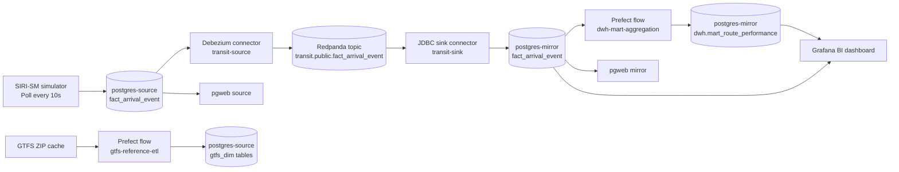
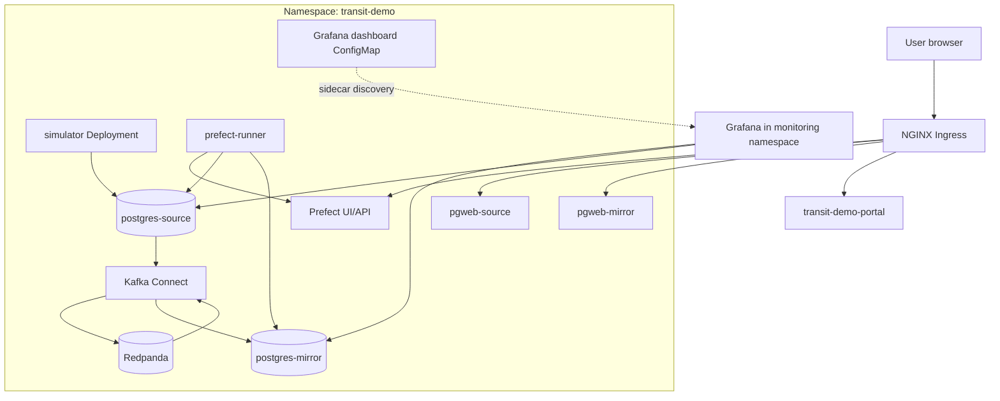

# Transit Demo Observability

This document captures the ETL path used by the transit demo and the runtime architecture used on OKE.

## Grafana dashboard

The transit demo chart now provisions a Grafana sidecar-discovered dashboard ConfigMap:

- `helm-charts/transit-demo/templates/grafana-dashboard.yaml`

The dashboard expects two Grafana PostgreSQL datasources:

- one pointed at `postgres-source`
- one pointed at `postgres-mirror`

It uses datasource variables, so it does not require fixed datasource names.

## ETL flow

## Kubernetes architecture

## BI dashboard intent

The dashboard is aimed at interview/demo narration rather than infra metrics. It focuses on:

- source freshness and mirror freshness
- event ingestion rate on source and mirror
- route delay trends from mirrored operational data
- mart trends from `dwh.mart_route_performance`
- latest mirrored arrival predictions as a live operational table